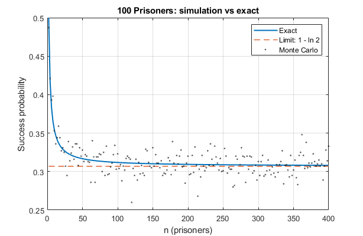

# 100 Prisoners

Monte Carlo simulation and exact analysis of the [100 prisoners problem](https://en.wikipedia.org/wiki/100_prisoners_problem), generalized to $n$ prisoners. \
Compares the loop strategy to independent random guesses.



## Problem
- Given $n$ numbered prisoners and $n$ boxes, a random permutation of labels $1, …, n$ is placed in the boxes in a room.
- Each prisoner walks into the room and may open at most $n/2$ boxes to find their number.
- They can agree on a strategy beforehand, but cannot communicate during play.
- They are released if everyone finds their number.

## Strategies
1. **Loop strategy**: Prisoner $i$ starts at box $i$, opens it, reads label $j$,
   then opens box $j$, and so on (up to $n/2$ steps). If there are no cycles longer than $n/2$, all of them will find their number.
2. **Random baseline**: Each prisoner opens $n/2$ random distinct boxes.

## Exact analysis
Since the probability of having a longest loop shorter than $n/2+1$ is messier due to the possibility of multiple such loops, it is easier to calculate the probability of having a loop longer than $n/2$. To have a loop with length $L > n/2$, first we must choose $"n$ choose $L$" $= n!/(L!(n-L)!)$ numbers and order them in $L!$ possible ways. However, due to the cyclic nature of the loop, we counted every possible loop $L$ times: permutations which can be shifted along the circle to transform into each other must be considered the same loop. So the number of possible ways a loop of length $L$ can exist is $(n!/(L!(n-L)!))(L!/L)$. But we still didn't take into account the number of ways the boxes which are **not** in the loop can be ordered: there are $(n-L)!$ possibilities, so the previous number of $L$-loops must be multiplied by $(n-L)!$. Finally, we have to divide the number of $L$-loop permutations by the total number of permutations of $n$, which is just $n!$, so: 

```math
\begin{aligned}
\mathrm{P}(\text{loop of length L exists}) = \frac{n!}{L! (n-L)!} \frac{L!}{L} \frac{(n-L)!}{n!} = \frac{1}{L}
\end{aligned}
```
<br>
 

Then, we just have to add all the $P(\text{loop of length n exists})$'s from $n/2+1$ to $n$ to get the probability of the prisoners **not** escaping. So, the probability of the prisoners' escape is: 
```math
\begin{aligned}
\mathrm{P}_n(\text{success}) = 1 - \mathrm{P}_n(\text{fail}) = 1 - \sum_{L=n/2}^{n}\frac{1}{L}
\end{aligned}
```
For $n = 100,$ this is:
```math
\begin{aligned}
\mathrm{P}_{100}(\text{success}) = 1 - \sum_{L=50}^{100}\frac{1}{L} = 1 - 0.6919 = 0.3118
\end{aligned}
```
<br>

To have a lower estimate of the probability of success, we can integrate $1/L$: 
```math
\begin{aligned}
\mathrm{P}_n(\text{success}) = 1 - \int\limits_{L=\frac{n}{2}}^{n}\frac{1}{L} \mathrm{d}L = 1 - \left(\ln(n)-\ln(n/2)\right) = 1 - \ln(2) = 0.3069
\end{aligned}
```
<br>

Which is independent of the number of prisoners $n$ and countless orders of magnitude greater than the random baseline $(1/2)^n$.

<br>

## Quick start
Run `prisoners_demo`, it calls `prisoners_sim` which handles the simulations.
